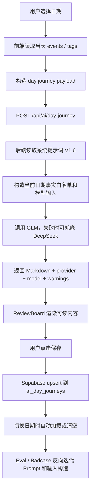

# 一天之旅 AI 功能 V0 收束总结

## 1. 功能背景与目标

「一天之旅」最初来自人工整理的日程回顾：用户把一天里的时间记录、项目推进、生活事件和复盘内容整理成一篇固定格式的日记式时间账本。它不是普通“今天做了什么”的总结，而是强调时间顺序、事实完整、客观表达和可回看的记录型文本。

V0 的目标，是让系统自动读取当前日期的日程 / 时间记录，调用 LLM，生成符合固定模板的「一天之旅」Markdown。这个能力服务的第一目标用户是我本人：一个持续记录时间、复盘项目、希望把日程变成可阅读资产的个人用户。后续它可以沉淀为时间管理产品里的 AI 日复盘能力。

这个功能的产品定位是 **LLM + Workflow**：前端收集当天 events / tags，后端按固定提示词调用模型，前端展示并保存结果。它不是 Agent，因为模型没有自主规划、工具选择和多步自主行动；它也不是 RAG，因为没有外部知识库检索、召回和引用链路。

## 2. V0 最终功能范围

V0 已完成的能力：

- 读取当前日期 events / tags。
- 构造结构化 payload。
- 调用 `POST /api/ai/day-journey`。
- 使用 `docs/ai-day-journey/一天之旅系统提示词.md` 生成 Markdown 格式「一天之旅」。
- 前端 `ReviewBoard` 展示生成结果。
- Markdown 渲染展示，页面不直接暴露 `##`、`###`、`**` 等原始符号。
- 支持重新生成。
- 保存到 Supabase 的代码链路已实现，`public.ai_day_journeys` 表结构、唯一约束、RLS 和四个 policy 已通过 Supabase 插件验证；前端保存按钮、重复 upsert、日期切换加载 / 清空仍建议补充手动验收记录。
- 已设计通过 `user_id + date` 保存当天最新版。
- 已实现切换已保存日期自动加载的前端逻辑，仍需结合真实数据库状态验收。
- 已实现切换未保存日期自动清空的前端逻辑，仍需结合真实数据库状态验收。
- 建立 Golden Set Eval。
- 建立 Badcase 记录。
- 建立 Consistency Eval。
- 系统提示词从 V0 迭代到 V1.6。
- 输入构造加入 `displayStartTime`、`displayEndTime`、`rawTitle`、`rawDescription`、`suggestedSegment`、`mustKeepFacts`、`current_day_fact_whitelist`、`inputSnapshot`、`source_event_ids` 等质量控制字段。

V0 暂不做的能力：

- 历史版本。
- 反馈按钮埋点。
- 自动化批量 Eval。
- 后台 Badcase 管理。
- 模型成本统计面板。
- 多模型对比面板。
- 删除入口。
- 多版本保存和对比。

## 3. 从 0 到 1 的落地过程

### 3.1 人工范本阶段

功能起点不是直接写接口，而是先人工打磨 2026 年 6 月 4 日的最终范本。这个范本确定了核心输出结构：日期标题、关键词、☀️早上、🌇下午、🌃晚上、每个阶段末尾的 `◆` 归纳，以及 `### 一天回顾` 下的三段第一人称回顾。

在人工范本中，逐步明确了关键词抽象层级、早中晚分段、时间写法、客观描述、短间隔事件合并、首行两个中文全角空格缩进等规则。随后又整理 2026 年 6 月 1 日、6 月 2 日、6 月 3 日作为补充 Golden Case，用来覆盖复盘日、工程调试日和复杂项目日。

6 月 4 日具有双重身份：它既是 input-output Golden Case，也是最高优先级最终范本。

### 3.2 文档资产阶段

项目先建立 `docs/ai-day-journey/`，而不是直接改代码。这是一个关键产品判断：如果没有先把范本、Prompt、接口契约、Eval 和 Badcase 分开沉淀，后续很容易把“能生成文字”误当成“功能完成”。

该目录下的核心资产包括：

- `00_总览_README.md`：说明目录用途和样例优先级。
- `一天之旅系统提示词.md`：后台 LLM 调用使用的系统提示词。
- `03_Golden_一天之旅最终范本.md`：最高优先级格式模板。
- `02_Prompt_一天之旅提示词迭代记录.md`：记录约 24 轮人工模板打磨过程。
- `04_接口_一天之旅接口契约设计.md`：先于实现定义接口输入输出。
- `06_测试_一天之旅接口测试记录.md`：记录接口真实样例测试。
- `04_接口_一天之旅AI功能接入过程记录.md`：记录从静态看板到 AI 功能的接入过程。
- `04_接口_一天之旅AI调用链路说明.md`：记录前端、接口、模型、保存的链路。
- `05_Eval_一天之旅生成验收与Badcase记录.md`：记录验收标准和 Badcase。
- `05_Eval_一天之旅GoldenSet对比记录.md`：记录 Golden Reference 对比。
- `05_Eval_一天之旅Eval运行记录.md`：记录 6.1 / 6.2 等回归测试。
- `05_Eval_一天之旅ConsistencyEval记录.md`：记录同日期多次生成稳定性测试。
- `08_面试_文科生够用工程概念词典.md`：把工程概念转成可理解的产品语言。

这些文档既是开发资产，也是 AI 产品经理作品集证据。

### 3.3 Prompt 与系统提示词阶段

系统提示词不是“让 AI 写得好”的一句话，而是这个功能的输出标准。它从 V0 框架逐步演进为稳定版 V1.6，核心变化包括：

- 固定 Markdown 输出结构。
- 强化事实保留。
- 约束时间格式为 `7:15`，避免 `07:15 - 08:00`。
- 增加早中晚分段规则。
- 规定 `◆` 阶段归纳粒度。
- 要求一天回顾为 ☀️ / 🌇 / 🌃 三段第一人称。
- 规定正文段落首行两个中文全角空格缩进。
- 修复一条 event 一个段落的流水账问题。
- 区分 Golden md 与当前 payload 的事实边界。

这体现了一个 AI 产品判断：Prompt 不只是文案，而是模型输出的产品规格书。

### 3.4 接口契约与 AI 接口阶段

在写接口前，先创建 `04_接口_一天之旅接口契约设计.md`，明确 `/api/ai/day-journey` 的作用、请求 payload、response、错误兜底和后续保存策略。

接口接收：

- `date`
- `timezone`
- `events`
- `tags`
- `options.promptVersion`
- `options.outputFormat`

接口返回：

- `success`
- `provider`
- `model`
- `promptVersion`
- `date`
- `markdown`
- `warnings`

空 events 返回 `NO_EVENTS`；模型失败返回 `AI_GENERATION_FAILED`；缺少 date 等无效输入返回明确错误。接口实现后先用真实 2026-06-04 payload 测试，再接入前端，避免把前端问题和模型质量问题混在一起。

### 3.5 前端看板接入阶段

`components/ReviewBoard.tsx` 从静态展示 6 月 4 日最终范本，升级为可触发 AI 生成的一天之旅看板。`App.tsx` 负责构造 payload、调用接口、管理 loading / success / error / saved / dirty 状态。

前端交互经历了几次收紧：

- 右侧小图标只负责打开 / 关闭看板，不自动生成，避免误消耗模型调用。
- 看板内黑色按钮才触发生成或重新生成。
- 成功后展示模型返回内容。
- 错误时展示 `NO_EVENTS` 或生成失败提示。
- 修复 Markdown 原始符号展示问题：页面展示为可读格式，但内部仍保留 raw Markdown，用于保存和后续追踪。

### 3.6 Golden Set Eval 与 Badcase 阶段

生成链路跑通后，重点转向质量，而不是继续堆功能。项目使用 6 月 1 日到 6 月 4 日作为 Golden Set：

- 6 月 1 日：复盘日。
- 6 月 2 日：项目开发和工程调试日。
- 6 月 3 日：复杂项目推进日。
- 6 月 4 日：最终范本。

每次生成后与 Golden Reference 对比，检查结构、事实、时间、关键词、早中晚分段、段落组织、一天回顾、术语统一和事实污染。典型 Badcase 包括时间点失真、关键词遗漏、事实改写、缺少 `### 一天回顾`、阶段归纳过粗、一天回顾过短、段落过碎等。

这些 Badcase 不是简单记录问题，而是反向推动 Prompt、输入构造和校验规则迭代。

### 3.7 Consistency Eval 阶段

在 2026-06-05 上做了同日期连续生成测试。目标不是要求逐字一致，而是要求同一日期多次生成时，在结构、事实覆盖、关键词、早中晚分段、阶段归纳和一天回顾风格上保持稳定。

V1.5 阶段发现明显问题：模型把 6 月 4 日 Golden 范本里的事实污染到 6 月 5 日输出中，例如 `yyw`、`东方树叶`、`《人工智能白皮书》`、`客观评判标准`、`最佳实践原则` 等。

V1.6 的修复原则是重新定义事实边界：

- 当前 payload 是唯一事实来源。
- Golden md 只能作为格式、风格、段落组织和 Eval Rubric 参考。
- 不再把完整 Golden md 原文作为当前生成的事实上下文。
- 增加 `current_day_fact_whitelist`。
- 降低 temperature 到更稳定的记录型生成区间。

V1.6 后，三次 2026-06-05 生成均未再出现上述外来事实污染，结构和段落组织稳定。

### 3.8 Supabase 保存阶段

生成结果如果只停留在接口响应里，仍然是临时内容。第 7 步开始把 AI 输出保存到 Supabase，使「一天之旅」从一次性生成结果变成按日期可回查的用户资产。根据当前文档记录，保存链路代码已实现，`timetrack / gbmecshpfuksylwflawi` 项目中的 `public.ai_day_journeys` 表、字段、`unique(user_id, date)`、RLS 和 `read_own` / `insert_own` / `update_own` / `delete_own` policy 已通过 Supabase 插件验证；前端保存按钮、重复 upsert、日期切换加载 / 清空仍应补充手动验收记录。

新增表 `public.ai_day_journeys`，核心字段包括：

- `user_id`
- `date`
- `markdown`
- `prompt_version`
- `model_provider`
- `model_name`
- `source_event_ids`
- `input_snapshot`
- `warnings`
- `created_at`
- `updated_at`

通过 `unique(user_id, date)` 保证同一用户同一天只保存一份最新版。保存使用 upsert：有则更新，没有则新增。切换日期时，已保存则自动加载，未保存则清空，避免上一天内容残留到新日期。当前数据库结构已验证存在；真实前端保存、重复保存是否更新同一条记录、快速切换日期是否稳定，仍需要用浏览器操作补充验收记录。

## 4. LLM + Workflow 链路

完整链路如下：



这是固定流程驱动的 AI 生成工作流。它不是 Agent，因为没有让模型自主决定下一步做什么；它不是 RAG，因为没有外部知识库检索和引用链路。它的核心价值是把“日程数据 → 结构化 Prompt → LLM 生成 → 前端展示 → 用户保存 → Eval 迭代”串成闭环。

## 5. Prompt 与输入构造迭代

系统提示词版本变化：

| 版本 | 主要变化 | 解决的问题 | 仍存在的问题 |
|---|---|---|---|
| V0 | 建立功能目标、输入说明、输出格式、核心规则、禁止事项 | 从人工范本沉淀为可讨论的 Prompt 框架 | 还不能直接稳定调用 |
| V1 | 固定 Markdown 结构、事实保留、时间格式、早中晚、一日回顾规则 | 形成可用于后台 LLM 调用的稳定版 | 未经过真实接口质量验证 |
| V1.1 | 强化时间格式、分段、事实保留、一日回顾完整度和阶段归纳 | 修复 6 月 4 日真实测试中的时间范围、分段和回顾过短问题 | 段落仍略偏逐条记录 |
| V1.2 | 引入 6.3 / 6.4 Golden 对比规则，增加 `displayStartTime` 约束和术语统一 | 修复时间点失真、关键词层级、短间隔合并、术语不统一 | 6.1 / 6.2 泛化仍不稳 |
| V1.3 | 强化关键词、完整结构、事实不得改写、午饭后分段、`◆` 粒度和一天回顾 | 修复 6.1 / 6.2 Golden Badcase，四个 Golden Case 均有可用结果 | 后续发现 Golden 原文注入会带来事实污染风险 |
| V1.4 | 要求正文段落首行两个中文全角空格 | 修复格式规范和页面 / Markdown 一致性 | 不解决内容质量 |
| V1.5 | 强化自然段合并，禁止一条 event 一个段落 | 修复 6.5 段落过碎、像日历流水账的问题 | Consistency Eval 暴露事实污染 |
| V1.6 | 当前 payload 作为唯一事实来源，Golden md 去事实化，只做风格和 Eval Rubric；增加 fact whitelist；temperature 降低 | 修复 Golden Reference 事实污染和同日期输出漂移 | 一天回顾信息密度仍可继续优化 |

输入构造的关键字段和产品原因：

- `displayStartTime`：让模型输出时间点时只能使用原始可展示时间，防止 `5:30` 被改成 `6:00`。
- `displayEndTime`：保留事件边界，但不鼓励模型直接输出完整时间范围。
- `rawTitle`：保留用户原始记录标题，减少整理过程中丢事实。
- `rawDescription`：保留补充描述，用于判断必须覆盖的事实。
- `suggestedSegment`：后台先给出早上 / 下午 / 晚上的初步建议，减少模型机械分段。
- `mustKeepFacts`：把标题和描述中的关键事实显式列出，提醒模型不能遗漏或改写。
- `inputSnapshot`：保存本次生成输入，方便后续 Eval、Badcase 和生成结果追踪。
- `source_event_ids`：记录生成结果来自哪些日程事件。
- `promptVersion`：标记本次生成使用哪一版系统提示词，用于复现、对比和作品集说明。

这些字段体现了一个核心判断：AI 生成质量不只靠 Prompt，也靠输入工程和可追踪数据。

## 6. Golden Set、Badcase 与 Consistency Eval

### 6.1 Golden Set

| 日期 | 样例类型 | 作用 |
|---|---|---|
| 2026-06-01 | 阅读、周复盘、月度复盘、历史复盘 | 测复盘日 |
| 2026-06-02 | 项目开发、Supabase、Trae、CodeX、AI PRD | 测工程调试日 |
| 2026-06-03 | 时间管理项目、系统法、CodeX、ChatGPT、老爸生日 | 测复杂项目日 |
| 2026-06-04 | 最终范本 | 最高格式标准 |

Golden Set 的作用不是让模型复制答案，而是给产品定义“什么叫合格”：结构、事实覆盖、关键词粒度、段落组织、阶段归纳和一天回顾风格都要可评估。

### 6.2 Badcase 类型

| Badcase | 问题类型 | 发现方式 | 修复方向 |
|---|---|---|---|
| 时间点失真 | 事实错误 | 6 月 3 日 Golden 对比 | 增加 `displayStartTime`，禁止模型自行推算时间 |
| 关键词遗漏或过泛 | 信息抽取不足 | 6 月 1 日、6 月 2 日、6 月 3 日 Golden 对比 | 强化关键词必须覆盖当天主线 |
| 一天回顾过短 | 事实覆盖不足 | 6 月 4 日接口测试、6 月 5 日 Consistency Eval | 要求三段回顾保留关键事实 |
| 阶段归纳过粗 | 归纳粒度不合格 | 6 月 1 日 / 6 月 2 日 Golden 对比 | `◆` 必须列出本时段关键事项 |
| 缺少 `### 一天回顾` | 必要结构缺失 | 6 月 2 日回归测试 | 强化完整结构硬约束和 warnings |
| “帮老爸弄照片”变成“老爸生日” | 事实改写 | 6 月 2 日 Golden 对比 | 明确不得把原始事实改成另一个意思 |
| Markdown 原始符号展示 | 前端展示问题 | 页面验收 | 前端渲染 Markdown，同时保留 raw Markdown |
| 一条 event 一个段落 | 段落组织错误 | 6 月 5 日页面生成 | V1.5 强化自然段合并规则 |
| Golden Reference 事实污染 | 上下文边界错误 | 6 月 5 日 Consistency Eval | V1.6 去事实化 Golden 上下文，当前 payload 作为唯一事实来源 |
| 同一日期多次生成漂移 | 稳定性问题 | Consistency Eval | 降低 temperature，增加 fact whitelist 和输出校验 |
| 日期切换残留旧内容风险 | 状态管理问题 | 保存设计验收 | 使用 `selectedDateKey` 和 requestId 防止异步污染 |

### 6.3 Consistency Eval

Consistency Eval 的目的不是追求逐字一致，而是检查同一日期多次生成是否稳定满足同一套 Rubric。对 2026-06-05 连续生成 3 次后，发现 V1.5 阶段有明显事实污染和输出漂移。

V1.6 修复后，三次生成：

- 均包含完整结构。
- 均无 6.1 到 6.4 外来事实污染。
- 均保持自然段组织。
- 均保留两个中文全角空格缩进。
- Run 3 warnings 为空；Run 1 / Run 2 仅有一天回顾偏短的轻微提示。

这说明当前 V0 最关键的事实边界问题已经收束，但“回顾信息密度评分”和“自动重试”仍适合作为 V1 优化方向。

## 7. Supabase 保存与日期状态设计

`ai_day_journeys` 表结构来自 `supabase/migrations/004_ai_day_journeys.sql`：

| 字段 | 作用 |
|---|---|
| `id` | 主键 |
| `user_id` | 用户 ID，关联 `auth.users` |
| `date` | 本地日期 key 对应的日期 |
| `markdown` | 保存的一天之旅 Markdown |
| `prompt_version` | 生成使用的系统提示词版本 |
| `model_provider` | 模型服务商 |
| `model_name` | 模型名称 |
| `source_event_ids` | 本次生成使用的事件 ID 列表 |
| `input_snapshot` | 本次生成输入快照 |
| `warnings` | 生成格式或质量提醒 |
| `created_at` / `updated_at` | 创建和更新时间 |

设计重点：

- `unique(user_id, date)`：同一用户同一天只保存一份最新版。
- `upsert`：重复保存同一天时更新原记录，不新增多条。
- RLS policy：`read_own`、`insert_own`、`update_own`、`delete_own`，用户只能操作自己的记录。
- 生成后不自动保存，必须用户点击「保存」。
- 重新生成只覆盖页面内容，不自动覆盖数据库。
- 切换已保存日期自动加载。
- 切换未保存日期自动清空。
- 未登录时提示用户先登录后保存。
- 加载 / 保存失败时提示 migration 或表不存在的可能原因。
- 使用同一个 `selectedDateKey = YYYY-MM-DD` 串起生成、保存和读取，避免 UTC / timezone 导致保存到前一天或后一天。

这个设计重要的地方在于：AI 输出不再只是一次临时生成，而是具备了按日期沉淀为用户资产的产品路径。当前代码链路已经具备保存、读取和状态管理能力；是否已经完成真实落库，应以 Supabase migration 执行和前端保存验收记录为准。

## 8. 关键产品判断与取舍

1. 先做人工范本，再做 AI 生成：因为记录型 AI 功能必须先定义“好结果长什么样”，否则模型只能生成泛泛总结。
2. 先做文档资产，再写代码：因为这个功能涉及 Prompt、范本、Eval、Badcase、接口和保存，文档资产能降低需求漂移。
3. 先做系统提示词，再做接口：因为接口只是通道，真正决定输出边界的是系统提示词和输入构造。
4. 先做接口契约，再做实现：因为前后端都要对齐 date、events、tags、markdown、warnings 和错误码。
5. 先用终端测试接口，再接前端：为了把接口可用性、模型质量和 UI 展示问题分开定位。
6. 先做 Golden Set Eval，再做保存：因为保存之前要先确认生成内容有基本质量，否则只是保存不稳定结果。
7. 先保存当天最新版，不做历史版本：V0 先满足最核心的“按日期回查”，历史版本会增加 UI、数据结构和产品复杂度。
8. 先手动 Eval，不做自动 Eval：V0 阶段更重要的是建立 Rubric 和 Badcase 类型，自动化可以后置。
9. 先处理生成稳定性，再做反馈埋点：如果输出本身不稳定，反馈数据会混入太多噪音。
10. Golden md 只能作为格式和 Eval 参考，不能作为生成事实来源：这是 V1.6 的关键质量判断，避免模型把样例事实污染到新日期。

## 9. AI 产品经理能力映射

| AI PM 能力 | 项目中的具体证据 |
|---|---|
| AI Workflow 设计 | 读取日程 → 构造 payload → 调用 LLM → 展示 → 保存 → Eval |
| Prompt 设计 | `一天之旅系统提示词.md` 从 V0 到 V1.6 的多版本迭代 |
| Eval 能力 | 4 个 Golden Case、Badcase 记录、Consistency Eval |
| Badcase 归因 | 时间错、关键词漏、事实污染、段落过碎、结构缺失等问题被拆成可修复项 |
| 数据意识 | Supabase 表、RLS、upsert、`inputSnapshot`、`promptVersion`、`source_event_ids` |
| 前端交互意识 | 生成、重新生成、保存、已保存加载、未保存清空、loading / error / dirty / saved 状态 |
| 工程协作 | 分阶段要求 CodeX 实现，限制改动范围，要求验收输出和文档同步 |
| 作品集表达 | 能讲清楚 LLM + Workflow + Eval + Badcase + 保存闭环 |

## 10. V0 收束标准

V0 当前收束标准：

1. 选择某一天，能生成一天之旅。
2. 生成结果符合模板。
3. 页面展示不暴露 Markdown 原始符号。
4. 生成结果不污染 Golden Reference 事实。
5. Supabase 表结构、唯一约束、RLS 和四个 policy 已通过插件验证。
6. 保存链路代码已实现，点击保存写入 Supabase 仍需补充前端手动验收记录。
7. 同一天重复保存 upsert 更新同一条记录的代码路径已实现，仍需补充前端手动验收记录。
8. 切换到已保存日期自动加载、切换到未保存日期自动清空的代码路径已实现，仍需补充前端手动验收记录。
9. 4 个 Golden Case 已有可用结果。
10. 至少一个真实日期完成 Consistency Eval。
11. 关键过程文档已沉淀。

当前状态说明：根据本地文档，6.1 / 6.2 / 6.3 / 6.4 均已有可用 Golden 结果；6.5 完成 V1.6 Consistency Eval，事实污染问题已修复。仍可继续在 V1 中增强自动 Eval、回顾信息密度和历史版本能力。

## 11. V1 后续路线

### V1 必做候选

- 历史版本。
- 反馈按钮埋点。
- 负反馈进入 Badcase。
- 自动 Eval 脚本。
- 生成耗时记录。
- 模型参数记录。

### V1 可选候选

- 多模型对比。
- 成本估算。
- 生成结果编辑。
- 删除保存记录。
- 导出完整周报 / 月报。

### 暂不做

- Agent 自动规划。
- RAG 知识库。
- 复杂后台管理系统。
- 多人协作。

## 12. 可用于作品集 / 面试的项目表达

### 12.1 作品集项目简介

「一天之旅」是我在时间管理项目中设计并落地的 AI 日复盘功能。它不是普通 AI 总结，而是一个 LLM + Workflow：系统读取当前日期的日程和标签，构造结构化 payload，调用 `/api/ai/day-journey`，生成固定 Markdown 格式的柳比歇夫式时间账本，并支持前端渲染、重新生成和 Supabase 保存链路。项目从 6 月 4 日人工最终范本出发，沉淀 4 个 Golden Case，通过 Badcase 和 Consistency Eval 迭代 Prompt、输入构造和事实边界，最终形成可生成、可展示、可追踪、具备保存闭环雏形的 AI 功能。

### 12.2 面试口述版本

我做了一个时间管理产品里的 AI 日复盘功能，叫「一天之旅」。一开始不是直接接模型，而是先人工打磨 6 月 4 日最终范本，明确关键词、早中晚、阶段归纳和一天回顾的格式。然后我把 6 月 1 日到 6 月 4 日整理成 Golden Set，先设计系统提示词和接口契约，再实现 `/api/ai/day-journey`。功能链路是前端读取当天 events 和 tags，构造 payload，后端调用 OpenAI-compatible 模型返回 Markdown，前端渲染展示，并实现按日期保存到 Supabase 的代码链路。过程中我用 Golden Set 和 Badcase 反复修复时间点失真、关键词遗漏、事实改写、段落过碎和 Golden 事实污染等问题，还做了同日期多次生成的 Consistency Eval。最后 V0 收束成一个 LLM + Workflow 功能：能生成、展示、重新生成，并具备按日期保存和回查的实现基础，也沉淀了 Prompt、Eval、Badcase 和数据追踪文档。

### 12.3 简历 bullet 版本

- 设计并落地时间管理产品中的「一天之旅」AI 日复盘功能，完成从人工范本、系统提示词、接口契约、前端看板到 Supabase 保存链路的 V0 闭环雏形。
- 建立 4 个 Golden Case、Badcase 记录和 Consistency Eval，用于评估生成结果的结构、事实覆盖、关键词、分段、段落组织和风格稳定性。
- 通过 Prompt 版本迭代和输入构造优化，修复时间点失真、事实改写、关键词遗漏、段落过碎和 Golden Reference 事实污染等核心质量问题。
- 设计 `user_id + date` 的保存策略，使用 Supabase upsert、RLS、`inputSnapshot`、`promptVersion` 和 `source_event_ids` 将 AI 输出沉淀为可回查用户资产。
- 将功能定位为 LLM + Workflow，明确区分 Agent、RAG 和固定流程生成能力，形成可用于作品集和面试表达的 AI PM 项目案例。

## 13. 关键证据索引

这份总结文档可以作为「一天之旅」AI 功能 V0 的证据中心。以下索引用于快速定位系统提示词、接口、Eval、Badcase、测试结果、保存链路和前端实现。

| 证据类型 | 文件 / 位置 | 说明 |
|---|---|---|
| 系统提示词 | `docs/ai-day-journey/一天之旅系统提示词.md` | 当前为稳定版 V1.6，定义输出结构、事实边界、段落组织和格式规则。 |
| Prompt 版本记录 | `docs/ai-day-journey/02_Prompt_一天之旅系统提示词版本变更记录.md` | 记录 V1.3 / V1.4 / V1.5 / V1.6 的版本修复目标和回归测试。 |
| 最终范本 | `docs/ai-day-journey/03_Golden_一天之旅最终范本.md` | 2026 年 6 月 4 日最终版，作为最高优先级格式模板。 |
| 早期提示词迭代 | `docs/ai-day-journey/02_Prompt_一天之旅提示词迭代记录.md` | 记录模板约 24 轮迭代形成过程。 |
| 接口契约 | `docs/ai-day-journey/04_接口_一天之旅接口契约设计.md` | 定义 `/api/ai/day-journey` 的 payload、response、错误兜底和保存策略。 |
| 接口测试 | `docs/ai-day-journey/06_测试_一天之旅接口测试记录.md` | 记录 2026-06-04 真实样例接口测试、空 events 兜底和 V1.1 修复。 |
| AI 功能接入过程 | `docs/ai-day-journey/04_接口_一天之旅AI功能接入过程记录.md` | 记录从静态看板到 AI 接口、前端接入、保存链路的过程。 |
| AI 调用链路 | `docs/ai-day-journey/04_接口_一天之旅AI调用链路说明.md` | 记录 ReviewBoard、App、接口、模型、保存链路；已补充 V1.6 事实边界与一致性链路。 |
| Golden Set | `docs/ai-day-journey/examples/` | 保存 6 月 1 日到 6 月 4 日的原始日历与一天之旅样例。 |
| Eval 运行记录 | `docs/ai-day-journey/05_Eval_一天之旅Eval运行记录.md` | 记录 6.1 / 6.2 Golden 回归测试和 V1.3 修复结果。 |
| Golden Set 对比 | `docs/ai-day-journey/05_Eval_一天之旅GoldenSet对比记录.md` | 记录 6.3 / 6.4 Badcase 和修复前后对比。 |
| Badcase 记录 | `docs/ai-day-journey/05_Eval_一天之旅生成验收与Badcase记录.md` | 记录接口、前端、Prompt、保存、段落组织、事实污染等 Badcase。 |
| Consistency Eval | `docs/ai-day-journey/05_Eval_一天之旅ConsistencyEval记录.md` | 记录 2026-06-05 同日期多次生成测试和 V1.6 修复结论。 |
| 测试 payload | `docs/ai-day-journey/test-payloads/` | 保存 2026-06-01 到 2026-06-05 的接口测试输入。 |
| 测试结果 | `docs/ai-day-journey/test-results/` | 保存多轮生成结果和 response JSON。 |
| 工程概念词典 | `docs/ai-day-journey/08_面试_文科生够用工程概念词典.md` | 将 Prompt、Eval、RLS、upsert、inputSnapshot 等概念转成可理解语言。 |
| Supabase migration | `supabase/migrations/004_ai_day_journeys.sql` | 创建 `ai_day_journeys` 表、唯一约束和 RLS policy。 |
| 前端看板 | `components/ReviewBoard.tsx` | 负责一天之旅看板展示、生成、保存按钮和 Markdown 渲染。 |
| 保存 service | `utils/dayJourneyService.ts` | 封装 `getDayJourney` 和 `saveDayJourney`，使用 Supabase upsert。 |
| 主状态管理 | `App.tsx` | 负责 selectedDateKey、生成请求、保存状态、异步安全和日期切换加载。 |

## 14. V0 验收清单

以下清单用于把 V0 是否收束变成可检查状态。状态基于当前本地文档和代码文件判断；保存相关真实落库结果如果没有明确记录，统一标为待验收或待执行。

| 验收项 | 状态 | 备注 |
|---|---|---|
| 选择某一天，能生成一天之旅 | 已完成 | 前端已接入 `/api/ai/day-journey`，测试结果文件中有多日期生成输出。 |
| 页面展示不暴露 Markdown 原始符号 | 已完成 | `ReviewBoard` 已做 Markdown 渲染展示。 |
| 正文段落首行缩进两个中文全角空格 | 已通过 | V1.4 已加入规则，6.4 v4 和后续结果保留缩进。 |
| 重新生成可用 | 已完成 | 看板内保留重新生成按钮，重新调用接口但不自动保存。 |
| 4 个 Golden Case 完成对比 | 已通过 | 6.1 / 6.2 / 6.3 / 6.4 均有对比和生成结果记录。 |
| Badcase 已记录 | 已完成 | `05_Eval_一天之旅生成验收与Badcase记录.md` 已记录多类 Badcase。 |
| 6.5 完成 Consistency Eval | 已通过 | 根据本地 `05_Eval_一天之旅ConsistencyEval记录.md`，V1.6 后三次生成无外来事实污染。 |
| 生成结果不污染 Golden Reference 事实 | 已通过 | 根据本地 V1.6 记录，6.5 不再混入 6.1-6.4 外来事实。 |
| Supabase migration 文件已创建 | 已完成 | `supabase/migrations/004_ai_day_journeys.sql` 已存在。 |
| Supabase 表结构已验证 | 已完成 | Supabase 插件已验证 `timetrack / gbmecshpfuksylwflawi` 中 `public.ai_day_journeys` 表、字段、唯一约束、RLS 和四个 policy 存在。 |
| 保存按钮写入数据库 | 代码已实现，需手动验收记录 | `ReviewBoard` / `App.tsx` / `dayJourneyService` 已实现保存链路，建议补充浏览器点击保存后的数据库记录截图或文字验收。 |
| 同一天重复保存 upsert 更新同一条记录 | 代码已实现，需手动验收记录 | migration 有 `unique(user_id, date)`，service 使用 `onConflict: 'user_id,date'`。 |
| 切换已保存日期自动加载 | 代码已实现，需手动验收记录 | `App.tsx` 使用 `getDayJourney(userId, selectedDateKey)`。 |
| 切换未保存日期自动清空 | 代码已实现，需手动验收记录 | `App.tsx` 日期切换会清空并按新日期加载。 |
| 未登录保存有明确提示 | 代码已实现，待验收 | 保存前检查 currentUser，提示先登录。 |
| `npm run build` 通过 | 待补充 | 早期文档记录曾通过；V1.6 后最新 build 结果未在本文档中重新记录。 |
| 关键过程文档已沉淀 | 已完成 | docs 目录已形成 Prompt、接口、Eval、Badcase、调用链路、词典和收束总结。 |

## 15. 当前风险与约束

V0 已经形成可用的 LLM + Workflow 雏形，但仍需要明确产品边界：

1. 模型输出仍有一定随机性，需要继续用 Consistency Eval 控制同日期多次生成的漂移。
2. Golden Reference 只能作为格式、风格和 Eval 参考，不能作为当前日期事实输入，否则会造成事实污染。
3. 保存功能依赖 Supabase migration、RLS、upsert 和前端状态管理正确配置；任一环节缺失都会影响真实保存。
4. 当前 V0 只保存同一天最新版，不保留历史版本，因此无法回看同一天多次生成差异。
5. 当前 Eval 以人工评估为主，自动化 Eval 脚本后置。
6. 当前功能不包含用户反馈埋点，真实用户反馈闭环后置。
7. 当前没有做多模型对比和成本统计，无法系统比较 GLM / DeepSeek 的质量、稳定性和成本。
8. 当前没有后台 Badcase 管理系统，Badcase 仍以 Markdown 文档方式管理。
9. 日期切换、异步请求和 timezone 仍是需要重点验收的产品风险，尤其要防止旧日期请求覆盖新日期看板。
10. 当前功能定位是 LLM + Workflow，不应过早扩展成 Agent 或 RAG；过早扩展会增加不必要复杂度。

这些不是失败点，而是 V0 的边界。它们为 V1 的历史版本、反馈闭环、自动 Eval 和稳定性增强提供了清晰依据。

## 16. 下一步最小行动

基于当前本地文档，Supabase 表结构已经通过插件验证，保存链路代码也已存在。下一步最小行动应优先补齐前端手动验收记录，而不是继续扩展新功能：

1. 前端手动测试「保存」按钮。
2. 保存 2026 年 6 月 5 日的一天之旅。
3. 在 Supabase 中确认对应 `user_id + date` 记录存在。
4. 同一天重复保存，验证 upsert 更新同一条记录。
5. 切换到 2026 年 6 月 4 日、6 月 3 日，再切回 6 月 5 日。
6. 验证已保存日期自动加载，未保存日期自动清空。
7. 未登录状态点击保存，确认提示明确。
8. 运行 `npm run build`，记录当前版本构建结果。
9. 将验收结果写回本文件第 14 节「V0 验收清单」。

这些动作都可以在 1 到 2 天内完成，目标是把 V0 从“代码链路完成”推进到“真实保存闭环验收完成”。

## 17. 我的 AI PM 认知变化

这个项目带来的关键认知，不是“模型可以帮我写总结”，而是 AI 功能要作为产品能力被设计、验收和沉淀。

1. AI 功能不是“接一个模型接口”，而是输入构造、系统提示词、输出展示、状态管理、保存、Eval 和 Badcase 的组合。
2. Prompt 不是临时话术，而是 AI 输出的产品规格。它要定义结构、事实边界、格式、禁止事项和验收标准。
3. Golden Set 的价值不是让模型照抄答案，而是定义“什么叫合格输出”。
4. Badcase 不是失败记录，而是下一轮产品迭代的依据。时间点失真、事实污染、段落过碎都能被拆成可修复问题。
5. 对记录型 AI 功能来说，事实边界比表达丰富更重要。宁可克制，也不能把别的日期事实写进当前日期。
6. 生成结果只有被保存、回查和评估，才真正成为用户资产。
7. AI 产品经理要能区分接口成功、生成成功、质量合格、产品可用这几层；它们不是同一件事。
8. 同一日期多次生成的一致性测试，是判断生成能力是否稳定的重要步骤。
9. 文档资产不是额外负担，而是让 Prompt、Eval、Badcase 和工程协作可追踪的基础。
10. 这个项目让我更清楚 LLM + Workflow 和 Agent、RAG 的区别：当前能力是固定流程生成，不是自主规划，也不是知识检索。

## 18. P0 项目源沉淀建议

建议将本文沉淀为 AI 产品经理作品集中的 P0 项目源文件，推荐文件名：

```text
P0—项目复盘—一天之旅AI功能V0收束总结—LLM Workflow与Eval闭环.md
```

建议标注为 P0，定位为 AI 产品经理作品集核心项目复盘。它不是简单功能说明，而是一个完整的 AI 产品落地案例，覆盖：

- 从人工范本到系统提示词。
- 从接口契约到模型调用。
- 从前端展示到保存链路。
- 从 Golden Set 到 Badcase。
- 从单次生成到 Consistency Eval。
- 从临时输出到用户资产。

后续可用于：

- 作品集项目页。
- 简历项目经历。
- 面试口述案例。
- AI PRD 写作素材。
- Eval / Badcase 训练样例。
- 项目复盘和 V1 规划。

需要同步更新项目源索引，把本文与系统提示词、Golden Set、Eval 记录、Consistency Eval 和 Supabase migration 建立引用关系。如果后续 V1 增加历史版本、反馈埋点、自动 Eval 或多模型对比，应在本文追加 V1 收束记录，或新建独立 V1 复盘文件，避免把 V0 和 V1 状态混写。
