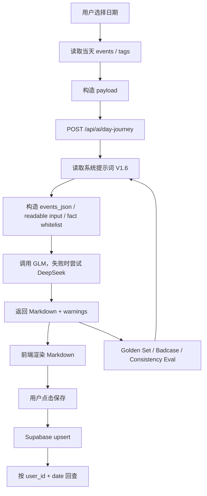

# 一天之旅 AI 自动复盘 PRD V0

## 0. 文档信息

| 项目 | 内容 |
|---|---|
| 文档名称 | 一天之旅 AI 自动复盘 PRD V0 |
| 功能名称 | 一天之旅 |
| 所属项目 | 时间管理项目 |
| 功能类型 | LLM + Workflow |
| 当前状态 | V0 已完成生成、前端展示、质量评估、保存链路和 Supabase 表验证 |
| 主要参考 | `docs/ai-day-journey/00_总览_一天之旅AI功能V0收束总结.md`、`一天之旅系统提示词.md`、`03_Golden_一天之旅最终范本.md`、`05_Eval_一天之旅生成验收与Badcase记录.md` |
| 本文用途 | 作为 AI 功能 PRD、作品集项目说明、面试表达底稿和后续 V1 规划依据 |

## 1. 项目一句话定位

「一天之旅」是时间管理项目中的 AI 自动复盘功能：系统读取用户某一天的日程 / 时间记录，调用 LLM 生成符合固定模板的 Markdown 版日复盘，并支持按日期保存和回查。

## 2. 功能背景

当前时间管理项目已经具备日历、事件、标签、历史记录、计时器、AI 日复盘等基础能力。用户可以记录一天发生了什么，但这些记录仍然偏“原始数据”或“日程列表”，需要人工整理后才适合回看和复盘。

「一天之旅」最初来自人工整理的 2026 年 6 月 4 日最终范本。这个范本不是普通总结，而是一种接近柳比歇夫式时间账本的日复盘文本：它保留时间线、事实、项目、生活事项和阶段归纳，让一天的时间流向变成可阅读、可回查的内容。

因此，本功能不是“让 AI 随便总结一天”，而是让 AI 在固定格式、事实边界和质量标准下，把当天时间记录转成稳定的「一天之旅」。

## 3. 目标用户

V0 的第一目标用户是：持续记录日程和时间片段，希望通过 AI 把原始记录整理成可阅读复盘文本的个人用户。

更具体地说，当前最适合的用户是：

- 每天记录较多时间片段的人。
- 有项目推进、学习、生活事件混合记录的人。
- 需要定期复盘时间流向的人。
- 希望把时间记录沉淀成作品集、日志或自我管理资料的人。

当前 V0 不面向团队协作、企业工时统计或多人审批场景。

## 4. 核心用户问题

### 4.1 已通过现有功能解决的问题

| 用户问题 | 当前解决方式 |
|---|---|
| 原始日程太碎，难以阅读 | AI 将当天 events 整理成「早上 / 下午 / 晚上 / 一天回顾」结构 |
| 用户不想手动写日复盘 | 点击生成后自动产出 Markdown |
| 普通 AI 总结容易太泛 | 系统提示词固定结构、事实保留和客观表达规则 |
| 模型容易漏事实或改事实 | 输入构造加入 `rawTitle`、`rawDescription`、`mustKeepFacts`、`displayStartTime` |
| AI 输出质量不稳定 | 建立 Golden Set、Badcase 和 Consistency Eval |
| 生成结果不能回查 | Supabase `ai_day_journeys` 表支持按 `user_id + date` 保存最新版 |

### 4.2 当前仍未完全解决的问题

| 问题 | 当前状态 |
|---|---|
| 生成结果历史版本 | V0 不保存历史版本，只保存当天最新版 |
| 用户反馈闭环 | V0 没有反馈按钮和埋点 |
| 自动化 Eval | 当前以人工 Golden Set 对比和文档记录为主 |
| 多模型质量对比 | V0 采用 GLM 优先、DeepSeek 兜底，没有模型对比面板 |
| 成本统计 | V0 没有 token 成本面板 |
| 生成结果编辑 | V0 暂不提供编辑器 |

### 4.3 后续 AI 能力可能解决的问题

- 自动识别生成结果中的事实遗漏。
- 自动运行 Golden Set 回归测试。
- 根据用户反馈沉淀 Badcase。
- 对同一天不同版本进行对比。
- 将日复盘进一步汇总为周报 / 月报。

## 5. 产品目标

### 5.1 V0 产品目标

1. 用户能基于当前日期生成一篇「一天之旅」。
2. AI 输出必须符合固定 Markdown 模板。
3. AI 输出必须以当天 events 为唯一事实来源。
4. 页面展示必须可读，不直接暴露 Markdown 原始符号。
5. 用户可主动保存生成结果。
6. 保存后可按日期自动加载。
7. 生成质量可通过 Golden Set、Badcase 和 Consistency Eval 追踪。

### 5.2 成功标准

| 指标 / 标准 | V0 标准 |
|---|---|
| 生成成功 | 当前日期有 events 时可生成 Markdown |
| 空数据兜底 | 当前日期无 events 时返回 `NO_EVENTS` |
| 输出结构 | 包含日期、关键词、早上、下午、晚上、一天回顾 |
| 事实边界 | 不使用当前 payload 外事实 |
| 展示体验 | 前端渲染为可读文本，不显示 `##`、`###`、`**` |
| 保存 | `user_id + date` 维度保存当天最新版 |
| 质量评估 | 至少 4 个 Golden Case + 1 个真实日期 Consistency Eval |

## 6. 非目标

V0 不包含：

- 完整 Agent。
- RAG 知识库。
- 历史版本管理。
- 自动化批量 Eval。
- 反馈按钮埋点。
- 多模型对比面板。
- 成本统计面板。
- 后台 Badcase 管理系统。
- 多人协作。
- Chrome 插件。
- 订阅系统。
- 商业化支付。

## 7. V0 功能范围

### 7.1 已实现 / 已设计能力

| 模块 | 功能描述 | 当前状态 |
|---|---|---|
| 入口 | 用户点击右侧「一天之旅」图标打开左侧看板 | 已实现 |
| 生成按钮 | 看板内黑色按钮触发生成，不打开即自动生成 | 已实现 |
| Payload 构造 | 前端读取当前日期 events / tags，构造结构化输入 | 已实现 |
| AI 接口 | `POST /api/ai/day-journey` | 已实现 |
| 模型调用 | GLM 优先，DeepSeek 兜底，OpenAI-compatible | 已实现 |
| Prompt | 使用「一天之旅系统提示词」V1.6 | 已实现 |
| Markdown 输出 | 接口返回 Markdown 正文 | 已实现 |
| 前端渲染 | 将 Markdown 渲染为可读视图 | 已实现 |
| 重新生成 | 用户可主动重新生成并覆盖页面内容 | 已实现 |
| 保存 | 用户点击保存后 upsert 到 Supabase | 代码已实现，表已验证存在 |
| 日期切换加载 | 切换日期时读取该日期保存记录 | 代码已实现，需持续手动验收 |
| 未保存日期清空 | 无保存记录时清空看板 | 代码已实现，需持续手动验收 |
| Golden Set | 6.1 到 6.4 四个 Golden Case | 已建立 |
| Consistency Eval | 6.5 同日期多次生成稳定性测试 | 已完成记录 |

### 7.2 相关代码位置

| 功能 | 文件 |
|---|---|
| 前端状态、生成、保存、日期切换 | `App.tsx` |
| 一天之旅看板 | `components/ReviewBoard.tsx` |
| AI 接口与模型调用 | `vite.config.ts` |
| Supabase 保存 / 读取 | `utils/dayJourneyService.ts` |
| 数据表 migration | `supabase/migrations/004_ai_day_journeys.sql` |
| 系统提示词 | `docs/ai-day-journey/一天之旅系统提示词.md` |
| Golden Set | `docs/ai-day-journey/examples/` |
| Eval / Badcase | `docs/ai-day-journey/05_Eval_一天之旅生成验收与Badcase记录.md` |

## 8. 用户路径

### 8.1 生成一天之旅

```text
用户选择日期
→ 点击右侧「一天之旅」图标
→ 左侧看板展开
→ 点击「生成一天之旅」
→ 前端收集当前日期 events / tags
→ 调用 /api/ai/day-journey
→ 返回 Markdown
→ ReviewBoard 渲染可读内容
```

### 8.2 保存一天之旅

```text
用户生成内容
→ 点击「保存」
→ 前端携带 markdown、promptVersion、provider、model、inputSnapshot、source_event_ids
→ dayJourneyService upsert 到 Supabase
→ 同一用户同一天只保留一份最新版
→ 页面显示已保存状态
```

### 8.3 切换日期查看保存内容

```text
用户切换日期
→ App 使用 selectedDateKey 查询 ai_day_journeys
→ 如果该日期有保存记录，加载 markdown
→ 如果没有保存记录，清空看板
→ 防止旧日期异步结果覆盖新日期
```

## 9. LLM + Workflow 设计



该功能是 LLM + Workflow：

- 流程由系统固定编排。
- 模型只负责在给定输入和 Prompt 下生成 Markdown。
- 没有让模型自主决定下一步行动。
- 没有外部知识检索链路。

因此，它不是 Agent，也不是 RAG。

## 10. 输入设计

### 10.1 请求 payload

V0 请求结构：

```json
{
  "date": "2026-06-05",
  "timezone": "Asia/Shanghai",
  "events": [],
  "tags": [],
  "options": {
    "promptVersion": "day-journey-system-prompt-v1.6",
    "outputFormat": "markdown"
  }
}
```

### 10.2 关键输入字段

| 字段 | 作用 |
|---|---|
| `date` | 当前选中日期，使用本地 `YYYY-MM-DD` |
| `events` | 当天全部日程 / 时间记录 |
| `tags` | 当前标签信息，用于理解类别 |
| `displayStartTime` | 模型可输出的开始时间，防止时间点失真 |
| `displayEndTime` | 保留事件结束时间，但不鼓励输出完整范围 |
| `rawTitle` | 原始事件标题 |
| `rawDescription` | 原始事件描述 |
| `suggestedSegment` | 后台建议早上 / 下午 / 晚上分段 |
| `mustKeepFacts` | 必须保留的事实 |
| `current_day_fact_whitelist` | 当前日期事实白名单，防止 Golden 事实污染 |

## 11. 输出设计

### 11.1 输出格式

AI 必须输出 Markdown：

```markdown
## 2026 年 X 月 X 日

　　**关键词：……**

### ☀️早上

　　……

　　**◆ ……**

### 🌇下午

　　……

　　**◆ ……**

### 🌃晚上

　　……

　　**◆ ……**

### 一天回顾

　　☀️：我……

　　🌇：我……

　　🌃：我……
```

### 11.2 输出约束

- 正文段落首行必须以两个中文全角空格开头。
- 时间点必须来自 `displayStartTime`。
- 不输出 `07:15 - 08:00` 这类日历表格式。
- 同一时段内不能一条 event 一个段落。
- Golden md 只能学习格式和风格，不能复制事实。
- 当前 payload 是唯一事实来源。
- 一天回顾必须是三段第一人称。

## 12. 前端交互需求

| 状态 | 页面表现 |
|---|---|
| 未打开 | 右侧日程面板展示「一天之旅」入口图标 |
| 打开看板 | 只展开看板，不自动生成 |
| 未生成 | 展示生成按钮和空状态 |
| 生成中 | 按钮 loading，防止重复点击 |
| 生成成功 | 展示渲染后的「一天之旅」 |
| 生成失败 | 展示错误提示和重试入口 |
| 无 events | 展示“当前日期暂无可生成的一天之旅记录” |
| 未保存 | 生成后显示未保存状态 |
| 已保存 | 保存成功后显示已保存状态 |
| 切换已保存日期 | 自动加载该日期保存内容 |
| 切换未保存日期 | 清空看板，不残留上一天内容 |

## 13. 数据与保存设计

### 13.1 Supabase 表

表名：`public.ai_day_journeys`

| 字段 | 说明 |
|---|---|
| `id` | 主键 |
| `user_id` | 用户 ID |
| `date` | 日期 |
| `markdown` | 保存的一天之旅 Markdown |
| `prompt_version` | 系统提示词版本 |
| `model_provider` | 模型服务商 |
| `model_name` | 模型名称 |
| `source_event_ids` | 本次生成使用的事件 ID |
| `input_snapshot` | 本次生成输入快照 |
| `warnings` | 生成提醒 |
| `created_at` | 创建时间 |
| `updated_at` | 更新时间 |

### 13.2 约束与权限

- `unique(user_id, date)`：同一用户同一天只保存一份最新版。
- RLS 已启用。
- policy 包含：
  - `read_own`
  - `insert_own`
  - `update_own`
  - `delete_own`

根据当前 Supabase 插件验证，`timetrack / gbmecshpfuksylwflawi` 项目中 `public.ai_day_journeys` 表已存在，字段、唯一约束、RLS 和四个 policy 已验证。

## 14. 错误与兜底

| 场景 | 处理方式 |
|---|---|
| 缺少 date | 返回 `INVALID_PAYLOAD` |
| events 为空 | 返回 `NO_EVENTS` |
| API Key 缺失 | 返回 `MISSING_API_KEY` |
| GLM 失败 | 尝试 DeepSeek fallback |
| 两个 provider 都失败 | 返回 `AI_GENERATION_FAILED` |
| 模型返回空内容 | 返回空输出错误或失败态 |
| Markdown 缺少必要结构 | 返回 warnings 或格式问题 |
| 表不存在 | 前端提示需要执行 migration |
| 未登录保存 | 提示先登录后保存 |
| 日期切换中旧请求返回 | 通过 selectedDateKey / requestId 丢弃旧结果 |

## 15. Eval 与质量标准

### 15.1 Golden Set

| 日期 | 样例类型 | 作用 |
|---|---|---|
| 2026-06-01 | 阅读、周复盘、月度复盘、历史复盘 | 测复盘日 |
| 2026-06-02 | 项目开发、Supabase、Trae、CodeX、AI PRD | 测工程调试日 |
| 2026-06-03 | 时间管理项目、系统法、CodeX、ChatGPT、老爸生日 | 测复杂项目日 |
| 2026-06-04 | 最终范本 | 最高格式标准 |

### 15.2 Badcase 类型

- 时间点失真。
- 关键词遗漏或过泛。
- 阶段归纳过粗。
- 一天回顾过短。
- 缺少 `### 一天回顾`。
- 事实改写。
- Markdown 原始符号直接展示。
- 一条 event 一个段落。
- Golden Reference 事实污染。
- 同日期多次生成漂移。
- 日期切换残留旧内容。

### 15.3 Consistency Eval

同一日期连续生成 3 到 5 次，检查：

- 结构是否一致。
- 事实覆盖是否稳定。
- 时间点是否来自原始记录。
- 关键词是否稳定。
- 段落组织是否稳定。
- 一天回顾是否稳定。
- 是否出现外来事实污染。

V1.6 后，2026-06-05 三次生成未再出现 6.1 到 6.4 Golden 事实污染。

## 16. 验收标准

| 验收项 | V0 标准 |
|---|---|
| 生成 | 有 events 的日期可生成一天之旅 |
| 空状态 | 无 events 返回 `NO_EVENTS` |
| 输出结构 | 日期、关键词、早上、下午、晚上、一天回顾完整 |
| 时间准确 | 时间点来自 `displayStartTime` |
| 事实边界 | 不使用 payload 外事实 |
| Markdown 展示 | 页面不直接显示 Markdown 原始符号 |
| 段落组织 | 同一时段合并为自然段，不是一条 event 一个段落 |
| 保存 | 点击保存后按 `user_id + date` 保存 |
| 重复保存 | upsert 更新同一条记录 |
| 日期切换 | 已保存自动加载，未保存清空 |
| Eval | 4 个 Golden Case + 6.5 Consistency Eval |
| 构建 | `npm run build` 通过 |

## 17. 关键产品取舍

1. 先人工范本，再 AI 生成：先定义好输出标准。
2. 先文档资产，再写代码：避免需求和质量标准混乱。
3. 先接口契约，再实现接口：减少前后端字段不一致。
4. 先终端测试，再接前端：分离接口问题和 UI 问题。
5. 先 Golden Set，再保存：避免保存低质量输出。
6. 先保存当天最新版，不做历史版本：控制 V0 复杂度。
7. Golden md 只做格式和 Eval 参考，不做事实来源：防止事实污染。
8. 先做人工 Eval，不做自动 Eval：先建立 Rubric，再自动化。

## 18. 当前风险与约束

- 模型仍有随机性，需要继续用 Consistency Eval 控制漂移。
- 当前 V0 不保留历史版本。
- 当前没有用户反馈埋点。
- 当前没有自动化 Eval 脚本。
- 当前没有多模型质量 / 成本对比。
- 当前保存依赖 Supabase、RLS、upsert 和前端状态管理正确配置。
- 日期、timezone、异步请求仍是重点验收风险。
- 当前是 LLM + Workflow，不应过早扩展成 Agent 或 RAG。

## 19. V1 后续路线

### 19.1 V1 必做候选

- 历史版本。
- 反馈按钮埋点。
- 负反馈进入 Badcase。
- 自动 Eval 脚本。
- 生成耗时记录。
- 模型参数记录。
- 一天回顾信息密度评分。

### 19.2 V1 可选候选

- 多模型对比。
- 成本估算。
- 生成结果编辑。
- 删除保存记录。
- 导出完整周报 / 月报。

### 19.3 暂不做

- Agent 自动规划。
- RAG 知识库。
- 复杂后台管理系统。
- 多人协作。

## 20. AI PM 简历表达

### 20.1 项目一句话

设计并落地时间管理产品中的 AI 自动复盘功能「一天之旅」，通过 LLM + Workflow 将当天日程记录生成结构稳定、事实可追踪、可保存回查的 Markdown 日复盘。

### 20.2 简历 bullet

- 基于个人时间管理场景设计「一天之旅」AI 复盘功能，完成从人工 Golden Reference、系统提示词、接口契约、前端看板到 Supabase 保存链路的 V0 落地。
- 建立 4 个 Golden Case、Badcase 记录和 Consistency Eval，用于评估时间准确性、事实保留、关键词、分段、段落组织和生成稳定性。
- 通过多轮 Prompt 与输入构造迭代，修复时间点失真、事实改写、关键词遗漏、段落过碎和 Golden Reference 事实污染等生成质量问题。
- 设计 `user_id + date` 的保存策略，结合 upsert、RLS、`inputSnapshot`、`promptVersion` 和 `source_event_ids`，将 AI 输出沉淀为可回查用户资产。

### 20.3 面试口述版本

我做了一个时间管理产品里的 AI 自动复盘功能，叫「一天之旅」。它的目标不是做泛泛的 AI 总结，而是把当天日程和时间记录生成固定格式的 Markdown 日复盘。我先人工打磨了 6 月 4 日最终范本，再整理 6 月 1 日到 6 月 4 日作为 Golden Set，基于这些样例设计系统提示词和输出标准。实现上，它是一个 LLM + Workflow：前端读取当前日期 events 和 tags，构造 payload，后端 `/api/ai/day-journey` 调用 OpenAI-compatible 模型生成 Markdown，前端渲染展示并支持保存到 Supabase。过程中我用 Golden Set、Badcase 和 Consistency Eval 持续修复时间点失真、关键词遗漏、事实改写、段落过碎和事实污染问题。这个项目让我完整经历了 AI 功能从需求、Prompt、接口、Eval 到数据保存的闭环。
