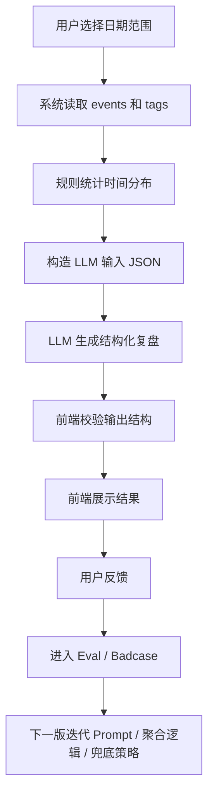

# AI 自动复盘 PRD V0

## 1. 功能一句话定位

AI 自动复盘是基于用户已记录的日历时间块、事件标题、起止时间、标签分类和规则统计结果，自动生成结构化自然语言复盘的 MVP 功能，帮助用户从“我记录了时间”进一步走到“我理解了时间花在哪里，以及下一步该怎么调整”。

## 2. 当前项目基础

当前项目是一个个人时间管理 Web/PWA 应用，已经具备较完整的非 AI 时间记录基础：

- 日历时间块：支持日、周、月视图，用户可以在日历中查看时间安排。
- 事件 CRUD：支持创建、编辑、删除日程事件，并有失败回滚和部分撤销能力。
- 标签分类：支持标签创建、编辑、删除、排序、筛选，事件可以归属到标签。
- 计时器 / 秒表：支持秒表和倒计时，完成后可以将计时结果同步成日程事件。
- 历史记录：支持按日期查看历史事件，并按标签筛选和分组。
- Supabase 同步：支持登录后的 events 和 tags 云端同步；缺少环境变量时可降级到本地行为。
- ICS / JSON 导入导出：支持 `.ics` 导入导出，以及 JSON 数据备份和恢复。
- 当前“智能洞察”只是前端规则统计，例如总时长、最多标签、最长连续时间、下一段空闲，不是真实 AI。

当前尚未实现：

- 真实 LLM 调用。
- AI 自动复盘。
- AI 结果存储。
- 用户反馈闭环。
- Eval 和 Badcase 体系。

## 3. 用户问题

当前用户已经可以记录：

- 每天做了哪些事。
- 每件事从几点到几点。
- 每件事属于哪个标签。
- 某一类标签大约花了多长时间。
- 哪些时间来自手动日程，哪些可能来自计时器记录。

但用户仍然需要自己判断：

- 今天的时间主要花在了什么方向。
- 学习、工作、休息、碎片时间之间是否失衡。
- 哪些时间段可能影响效率。
- 哪些事件是高价值投入，哪些只是被动消耗。
- 明天应该调整什么。

只看日历和标签统计还不够，因为日历解决的是“记录和展示”，标签统计解决的是“数量和分布”，但用户真正需要的是一段可读的解释：这些时间分布意味着什么，哪些地方值得保留，哪些地方需要调整，下一步可以做一个什么小动作。

因此，AI 自动复盘的核心价值不是替代日历，也不是凭空规划人生，而是把已有结构化时间数据转译成自然语言复盘和行动建议，降低用户每天总结的成本。

## 4. AI 必要性

### 应该由规则统计完成的部分

- 计算每个事件的 duration。
- 按标签聚合总时长和占比。
- 统计事件数量、最长事件、最短事件。
- 识别空档时间、连续记录时间、碎片时间数量。
- 判断当天或近 7 天是否有足够数据进入 AI 复盘。
- 生成稳定、可检查的 LLM 输入 JSON。

这些部分必须由确定性代码完成，不能直接交给 LLM 猜。

### 适合交给 LLM 的部分

- 将统计结果转成自然语言总结。
- 解释“时间分布”对用户可能意味着什么。
- 从标签、事件标题和时长中提炼关键洞察。
- 给出克制、具体、可执行的明日或下周建议。
- 在数据不足时，用合适语气说明限制，而不是强行下结论。

### 为什么第一版不需要完整 Agent

V0 的目标是生成复盘，不需要 AI 自主拆解任务、调用多个工具、修改用户日程或持续执行计划。完整 Agent 会显著增加状态管理、权限、安全和评估复杂度，不符合 6.8 前最低投递标准。

第一版采用 LLM + Workflow：系统先确定性聚合数据，再把干净输入交给 LLM 生成结构化结果。

### 为什么第一版不需要完整 RAG

当前项目还没有日记、目标、用户偏好、长期行为解释文本等可检索知识库。V0 只需要基于 events 和 tags 做日/周复盘。如果过早引入 RAG，容易把重点从 MVP 闭环转移到知识库构建、检索质量和引用评估上。

RAG 可以作为后续版本方向，用于接入用户日记、长期目标和历史复盘。

## 5. 目标用户和使用场景

### 目标用户

- 个人效率用户：已经愿意用时间块记录工作、学习、生活和休息。
- 求职 / 学习用户：希望通过复盘展示自我管理能力和持续投入过程。
- 自我管理用户：希望每天或每周知道时间投入是否偏离预期。
- 已经愿意记录时间的人：V0 不解决“自动采集行为”，先服务已有记录用户。

### 典型场景

- 每天晚上生成今日复盘：用户选择今天，查看 AI 总结、洞察、风险和明日建议。
- 每周末生成一周复盘：用户选择近 7 天，查看学习、工作、休息和碎片时间分布。
- 复盘学习投入：用户查看学习标签占比、连续学习时段、被打断情况。
- 复盘工作节奏：用户查看工作时间是否集中，是否存在过多碎片事件。
- 复盘休息与恢复：用户查看休息标签是否过少，晚间是否还有大量任务。

## 6. MVP 范围

V0 只做 AI 自动时间复盘的最小闭环：

- 支持选择今日或近 7 天作为复盘范围。
- 读取当前项目已有的 events 和 tags。
- 用规则统计生成时间分布摘要。
- 构造稳定的 LLM 输入 JSON。
- 调用 LLM 或形成半真实 Demo，用于作品集演示。
- 生成结构化 AI 复盘结果。
- 展示 `summary`、`time_distribution`、`insights`、`risks`、`actions`、`caveats`。
- 提供基础失败态，例如无记录、记录过少、LLM 请求失败、输出格式异常。
- 为 Eval 和 Badcase 提供样本记录。

V0 的重点是证明“已有时间管理产品如何升级为 AI 产品”：数据输入清楚、Workflow 清楚、输出结构清楚、评估方法清楚。

## 7. 非目标

V0 不做以下内容：

- 不做完整 RAG：当前没有可检索的用户日记、长期目标和历史复盘知识库。
- 不做完整 Agent：首版不需要 AI 自主规划、调用多工具或持续执行。
- 不自动修改用户日程：AI 只给建议，不直接创建、删除、移动事件。
- 不做 Chrome 插件：V0 不采集浏览器行为，只使用项目已有 events 和 tags。
- 不做订阅系统：本阶段目标是作品集 MVP，不验证付费商业化。
- 不做复杂目标管理：当前项目没有目标、OKR、任务完成状态等字段。
- 不做多用户商业化验证：V0 面向个人使用和作品集展示。
- 不做完整长期记忆：V0 可以展示近 7 天复盘，但不建立长期用户画像。

这些方向可以进入 V2 或更后续版本，但不进入 6.8 前最低投递范围。

## 8. 输入数据

第一版不直接把乱序原始数据全部丢给 LLM，而是先由规则逻辑完成清洗、排序、聚合，再构造可控的 LLM 输入。

### 原始输入

| 字段 | 说明 | 当前项目来源 |
| --- | --- | --- |
| date_range | 复盘日期范围，支持今日或近 7 天 | 用户选择 |
| events | 日期范围内事件列表 | App 中 events 状态或 eventService 查询结果 |
| event.title | 事件标题 | CalendarEvent.title |
| event.startTime | 开始时间 | CalendarEvent.startTime |
| event.endTime | 结束时间 | CalendarEvent.endTime |
| event.duration | 由 startTime 和 endTime 计算 | 规则统计生成 |
| event.category / tag id | 事件所属标签 ID 或分类 | CalendarEvent.category |
| tag.label | 标签名称 | tags 数据 |
| tag.color | 标签颜色，可选 | tags 数据 |
| tag.icon | 标签图标，可选 | tags 数据 |
| user_goal | 用户目标，可选，V0 可以先不做 | 后续版本 |
| user_note | 用户备注，可选，V0 可以先不做 | 后续版本 |

### 规则聚合输入

| 字段 | 说明 |
| --- | --- |
| total_duration_minutes | 日期范围内总记录时长 |
| duration_by_tag | 按标签聚合的总时长和占比 |
| event_count | 事件数量 |
| daily_breakdown | 近 7 天模式下按天聚合 |
| top_events | 时长较长或关键事件摘要 |
| fragmented_blocks | 短时长事件数量和占比 |
| empty_periods | 可识别的大段空白时间 |
| data_quality_warnings | 数据不足、标签缺失、异常时长等提醒 |

### LLM 输入示意

```json
{
  "date_range": {
    "type": "today",
    "start": "2026-06-05",
    "end": "2026-06-05"
  },
  "events_summary": [
    {
      "title": "产品 PRD 修改",
      "start_time": "09:00",
      "end_time": "10:30",
      "duration_minutes": 90,
      "tag": {
        "id": "tag_work",
        "label": "工作"
      }
    }
  ],
  "stats": {
    "total_duration_minutes": 420,
    "event_count": 6,
    "duration_by_tag": [
      {
        "tag_label": "工作",
        "duration_minutes": 210,
        "ratio": 0.5
      }
    ],
    "data_quality_warnings": []
  }
}
```

## 9. 输出结构

V0 建议 AI 输出 JSON，而不是自由 Markdown，方便前端展示、Eval 检查和 Badcase 归因。

### JSON Schema

```json
{
  "type": "object",
  "required": [
    "summary",
    "time_distribution",
    "insights",
    "risks",
    "actions",
    "caveats"
  ],
  "properties": {
    "summary": {
      "type": "string",
      "description": "一句话总结本次复盘范围内的时间使用情况"
    },
    "time_distribution": {
      "type": "array",
      "description": "按标签或日期解释时间分布",
      "items": {
        "type": "object",
        "required": ["label", "duration_minutes", "observation"],
        "properties": {
          "label": { "type": "string" },
          "duration_minutes": { "type": "number" },
          "ratio": { "type": "number" },
          "observation": { "type": "string" }
        }
      }
    },
    "insights": {
      "type": "array",
      "description": "基于数据得到的关键洞察",
      "items": {
        "type": "object",
        "required": ["title", "detail", "evidence"],
        "properties": {
          "title": { "type": "string" },
          "detail": { "type": "string" },
          "evidence": { "type": "string" }
        }
      }
    },
    "risks": {
      "type": "array",
      "description": "潜在风险或需要注意的时间分配问题",
      "items": {
        "type": "object",
        "required": ["risk", "reason"],
        "properties": {
          "risk": { "type": "string" },
          "reason": { "type": "string" },
          "severity": {
            "type": "string",
            "enum": ["low", "medium", "high"]
          }
        }
      }
    },
    "actions": {
      "type": "array",
      "description": "下一天或下一周可执行建议",
      "items": {
        "type": "object",
        "required": ["action", "why"],
        "properties": {
          "action": { "type": "string" },
          "why": { "type": "string" },
          "scope": {
            "type": "string",
            "enum": ["tomorrow", "next_week"]
          }
        }
      }
    },
    "caveats": {
      "type": "array",
      "description": "数据限制、模型限制和不可推断事项",
      "items": { "type": "string" }
    }
  }
}
```

### 示例 JSON

```json
{
  "summary": "今天的记录显示，你的主要时间集中在工作和学习上，但休息记录偏少，晚间仍有较长任务块。",
  "time_distribution": [
    {
      "label": "工作",
      "duration_minutes": 210,
      "ratio": 0.5,
      "observation": "工作占已记录时间的一半，是今天最主要的时间投入。"
    },
    {
      "label": "学习",
      "duration_minutes": 120,
      "ratio": 0.29,
      "observation": "学习时间有连续投入，适合在复盘中保留为正向行为。"
    },
    {
      "label": "休息",
      "duration_minutes": 30,
      "ratio": 0.07,
      "observation": "休息记录较少，可能需要确认是否漏记，不能直接判断休息不足。"
    }
  ],
  "insights": [
    {
      "title": "主要投入方向清晰",
      "detail": "工作和学习合计占比较高，说明今天的记录更偏向产出型活动。",
      "evidence": "工作 210 分钟，学习 120 分钟。"
    }
  ],
  "risks": [
    {
      "risk": "晚间任务可能压缩恢复时间",
      "reason": "记录中晚间仍有较长工作或学习事件。",
      "severity": "medium"
    }
  ],
  "actions": [
    {
      "action": "明天优先保留一段 60-90 分钟的连续学习或深度工作时间。",
      "why": "今天连续投入带来了较清晰的产出结构。",
      "scope": "tomorrow"
    },
    {
      "action": "补充记录休息或恢复时间，避免只记录任务时间。",
      "why": "当前休息数据较少，复盘无法准确判断恢复是否充分。",
      "scope": "tomorrow"
    }
  ],
  "caveats": [
    "当前复盘只基于已记录事件，不能代表全天真实行为。",
    "当前没有用户目标字段，因此不判断目标是否达成。"
  ]
}
```

## 10. Workflow

V0 是 LLM + Workflow，不是完整 Agent。系统负责读取、清洗、统计和结构化输入；LLM 只负责在约束内生成复盘文本。

### 文字流程

1. 用户选择日期范围：今日或近 7 天。
2. 系统读取 events 和 tags。
3. 系统按日期、标签、时长做规则统计。
4. 系统构造 LLM 输入 JSON。
5. LLM 生成结构化复盘 JSON。
6. 前端校验输出字段是否完整。
7. 前端展示复盘结果。
8. 用户选择反馈：有帮助、不准确、太空泛、建议不可执行。
9. 反馈进入 Eval / Badcase 文档记录。
10. 下一版基于 Badcase 迭代 Prompt、数据聚合或输出结构。

### Mermaid



## 11. 前端展示要求

AI 复盘结果应以轻量面板展示，避免打断现有日历和历史记录主流程。

- 一句话总结：展示 `summary`，让用户快速知道今天或本周的主结论。
- 时间分布观察：展示 `time_distribution`，按标签或日期列出时长、占比和解释。
- 关键洞察：展示 `insights`，每条洞察必须带 evidence，避免无依据判断。
- 风险提醒：展示 `risks`，用低/中/高标识风险程度，但语气保持克制。
- 明日 / 下周行动建议：展示 `actions`，建议数量控制在 2-4 条，每条说明原因。
- 注意事项：展示 `caveats`，说明数据不足、未记录时间、无目标字段等限制。

建议入口：

- 日历右侧事件面板增加“AI 复盘”按钮。
- 历史记录页按日期查看时增加“生成今日复盘”入口。
- 近 7 天复盘可作为历史记录页的范围切换能力。

## 12. 失败态和兜底

| 失败态 | 判断条件 | 建议提示文案 |
| --- | --- | --- |
| 当天没有记录 | 日期范围内 events 为空 | 今天还没有可复盘的时间记录。先记录几段日程或计时后，再生成 AI 复盘。 |
| 记录太少 | 事件数少于 2 条或总时长过短 | 当前记录较少，AI 只能做非常有限的总结。建议补充主要学习、工作或休息时间后再复盘。 |
| LLM 请求失败 | API 超时、网络失败、服务异常 | AI 复盘生成失败。你仍可以先查看本地时间统计，稍后再重试。 |
| 输出格式异常 | 缺少必填字段或 JSON 解析失败 | AI 输出格式异常，已切换为基础统计摘要。建议重新生成一次。 |
| AI 建议太空泛 | actions 缺少具体动作或依据 | 本次建议不够具体，已记录为优化样本。你可以重新生成，或先参考时间分布结果。 |
| AI 过度推断 | 出现目标、情绪、性格、动机等输入中不存在的信息 | 本次复盘包含超出数据范围的判断，建议重新生成。我们会将该案例用于下一版 Prompt 优化。 |
| 用户数据不足 | 标签缺失、标题过短、存在异常时长 | 当前数据不足以支持完整判断。复盘会只引用可确认的时间和标签信息。 |

兜底原则：

- 没有数据时不强行调用 LLM。
- 数据不足时必须明确说明限制。
- 输出异常时优先展示规则统计，不展示可能误导用户的 AI 文本。
- 所有严重问题都进入 Badcase。

## 13. 用户反馈

V0 设计最小反馈机制，先服务迭代，不强制入库。

### 反馈选项

- 有帮助：说明复盘对用户理解时间分布有价值。
- 不准确：说明 AI 引用了错误事实、误读标签或时长。
- 太空泛：说明复盘没有具体结合事件和时间数据。
- 建议不可执行：说明 actions 太大、太虚或无法落地到明天/下周。

### 反馈进入迭代的方式

V0 可以先记录到文档：

- `04-AI自动复盘-Badcase-V0.md`：记录不准确、太空泛、建议不可执行等失败案例。
- `03-AI自动复盘-Eval-V0.md`：记录样本评分和通过率。
- `05-Prompt版本记录.md`：记录 Prompt 修改原因和关联 Badcase。
- `06-ClaudeCode-Codex开发记录.md`：记录实现、验证和修复过程。

后续版本可以考虑将反馈保存到 Supabase，但 V0 不强制实现反馈入库。

## 14. Eval 初步方案

### 评分维度

| 维度 | 说明 |
| --- | --- |
| 数据准确性 | 是否准确引用事件、标签、时长、日期范围，不编造事实 |
| 洞察具体性 | 是否能结合具体时间分布和事件，而不是泛泛而谈 |
| 建议可执行性 | 建议是否能在明天或下周直接执行 |
| 个性化程度 | 是否基于用户本次记录，而不是通用效率鸡汤 |
| 克制性 | 是否避免过度心理判断、目标判断和因果推断 |

### 1 到 5 分 Rubric 思路

| 分数 | 标准 |
| --- | --- |
| 5 | 完全基于输入数据，结构稳定，洞察具体，建议可执行，明确说明限制 |
| 4 | 基本准确，有轻微泛化，但不影响用户理解和使用 |
| 3 | 可读但不够具体，部分建议偏通用，需要 Prompt 优化 |
| 2 | 存在明显误读、空泛建议或结构缺失，不适合直接展示 |
| 1 | 编造关键事实、过度推断或严重格式错误，必须作为 Badcase 修复 |

### 通过标准

- 单样本总分 >= 4 分。
- 数据准确性必须 >= 4 分。
- 克制性必须 >= 4 分。
- 10 个最小样本中至少 8 个通过。
- 任何样本出现编造事件、编造标签、编造目标或编造情绪，直接判定为不通过。

### 最少测试样本数量

V0 最少准备 10 条样本：

- 2 条正常工作日样本。
- 2 条学习为主样本。
- 1 条休息较多样本。
- 1 条碎片时间较多样本。
- 1 条记录很少样本。
- 1 条无记录样本。
- 1 条标签缺失样本。
- 1 条近 7 天复盘样本。

### 不能接受的输出

- 编造不存在的事件、标签、时长、日期。
- 在没有目标字段时判断“目标达成”或“目标失败”。
- 对用户心理、性格、自律程度做武断判断。
- 不区分事实和推测。
- 只输出泛泛建议，例如“提高效率”“合理规划时间”。
- 输出不是约定 JSON 结构，导致前端无法稳定渲染。

## 15. Badcase 初步分类

| Badcase 类型 | 说明 |
| --- | --- |
| 数据不足 | 事件太少、总时长太短，AI 仍强行总结 |
| 标签过粗 | 标签无法表达真实活动，导致洞察不具体 |
| Prompt 太泛 | Prompt 没有限制 AI 必须引用证据 |
| 误读时间记录 | AI 错误理解时间段、占比或事件顺序 |
| 输出空泛 | 总结像通用效率建议，没有结合当天数据 |
| 建议不可执行 | 建议太大、太抽象，不能落地到明天或下周 |
| 过度心理判断 | AI 推断用户拖延、焦虑、自律差等心理状态 |
| 忽略关键时间段 | 没有提到最长事件、晚间事件或大段空白 |
| 没有区分事实和推测 | 把可能原因说成确定结论 |
| 输出格式不稳定 | JSON 字段缺失、类型错误或结构漂移 |

## 16. 验收标准

AI 自动复盘 V0 完成的标准：

- 页面有 AI 复盘入口。
- 能读取指定日期范围的数据，至少支持今日和近 7 天。
- 能基于 events 和 tags 生成时间统计摘要。
- 能调用 LLM 或形成半真实 Demo，用于作品集演示。
- 能输出结构化结果，包含 `summary`、`time_distribution`、`insights`、`risks`、`actions`、`caveats`。
- 有无记录、记录太少、请求失败、格式异常等失败态提示。
- 有 Eval 样本和 Badcase 记录。
- 能截图或录屏用于作品集、简历和面试表达。
- 文档能说明为什么采用 LLM + Workflow，而不是一开始做完整 RAG 或 Agent。

## 17. 后续版本规划

### V0：AI 自动复盘最小闭环

- 今日 / 近 7 天复盘。
- 规则统计 + LLM 结构化输出。
- 基础失败态。
- 最小用户反馈。
- Eval 和 Badcase 文档记录。
- 作品集截图和讲解材料。

### V1：反馈、保存和评估优化

- 保存 AI 复盘结果。
- 将用户反馈结构化记录。
- 基于 Badcase 迭代 Prompt。
- 增加更多 Eval 样本。
- 优化输出 JSON Schema。
- 支持用户补充一段备注或目标，再生成更贴近上下文的复盘。

### V2：RAG / Agent / 插件 / 商业化方向

以下均为后续版本，不属于 V0：

- 日记 RAG：接入用户日记、周记、目标文本，让复盘能引用长期背景。
- 长期行为模式分析：识别多周趋势、周期性失衡、稳定投入模式。
- Agent 化：在用户确认后，帮助拆解调整计划或生成待办建议。
- Chrome 插件：采集浏览器行为作为时间记录补充，但需要隐私和权限设计。
- 订阅方向：当功能稳定、有真实用户反馈后，再探索商业化。

## 18. 面试表达摘要

我做这个功能的原因，是因为这个项目原本已经有比较完整的时间管理基础，包括日历时间块、事件增删改查、标签系统、计时器、历史记录、Supabase 同步和 ICS/JSON 导入导出。但它解决的主要还是“记录时间”和“查看时间”，用户每天仍然要自己判断时间花得是否合理、哪些地方需要调整。

所以我把升级方向收敛到一个 AI 自动复盘 MVP：先不做复杂 Agent，也不做完整 RAG，而是基于当前已有的 events 和 tags，用规则逻辑先计算时长、标签占比、事件数量、碎片时间等确定性统计，再把这些结构化数据交给 LLM，生成包含总结、时间分布、关键洞察、风险、行动建议和注意事项的 JSON 输出。

我选择 LLM + Workflow，是因为第一版最重要的是可控和可评估。规则统计负责事实，LLM 负责表达和轻量推理，这样既能展示 AI 产品能力，也能避免模型直接面对乱序原始数据后编造结论。

为了让它更像一个真正的 AI 产品，而不是单纯接一个 API，我会设计 Eval 和 Badcase：从数据准确性、洞察具体性、建议可执行性、个性化程度、克制性五个维度评分；同时记录数据不足、误读时间记录、输出空泛、过度心理判断、格式不稳定等 Badcase。下一版会基于这些反馈迭代 Prompt、输出结构和数据聚合逻辑。

后续如果继续扩展，我会先做用户反馈和复盘保存，再考虑把用户日记、长期目标接入 RAG，最后才评估 Agent 化、Chrome 插件和订阅商业化方向。这样路线从 MVP 到高级 AI 能力是逐步成立的，也适合作为 AI 产品经理作品集讲清楚。

## 版本记录

| 日期 | 版本 | 修改内容 | 修改人 |
| --- | --- | --- | --- |
| 2026-06-05 | V0 | 基于非 AI 版 PRD 重写 AI 自动复盘 PRD，补齐 MVP、输入输出、Workflow、Eval、Badcase、验收和面试表达 | Codex |
