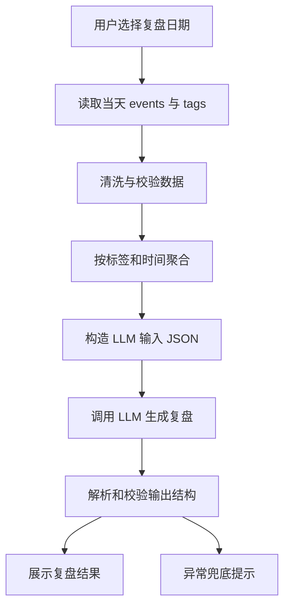

# AI 自动复盘 Workflow V0

## 1. Workflow 目标

用确定性的前端数据聚合逻辑生成 LLM 输入，再由 LLM 生成结构化日复盘。V0 只采用 LLM + Workflow，不引入 RAG、Agent、Chrome 插件或订阅系统。

## 2. 总流程



## 3. 数据读取

### 输入

| 输入 | 说明 | 备注 |
| --- | --- | --- |
| selectedDate | 用户选择的日期 | 必需 |
| events | 当前日期相关事件 | 必需 |
| tags | 标签列表 | 必需 |

### 规则

- 只处理选中日期范围内的事件。
- 跨天事件需要按当天有效时间段计算。
- 标签缺失时显示为“未分类”。
- 同时间段多标签事件是否重复计入，需要在数据聚合逻辑中明确。

## 4. 数据清洗

| 检查项 | 处理方式 |
| --- | --- |
| 缺少标题 | 使用“未命名事项” |
| 缺少标签 | 归为“未分类” |
| 开始时间晚于结束时间 | 排除该事件并记录异常 |
| 时长为 0 | 排除或标记为无效事件 |
| 事件列表为空 | 不调用 LLM，展示空数据兜底 |

## 5. 数据聚合

### 聚合字段

| 字段 | 说明 |
| --- | --- |
| totalDurationMinutes | 当天总记录分钟数 |
| eventCount | 当天事件数 |
| durationByTag | 按标签统计分钟数 |
| topTags | 时长最高的标签 |
| longestEvents | 最长事件列表 |
| timeline | 按时间排序的事件摘要 |
| gaps | 可识别空档 |
| dataWarnings | 数据异常说明 |

## 6. LLM 输入结构

```json
{
  "date": "YYYY-MM-DD",
  "locale": "zh-CN",
  "events": [],
  "tags": [],
  "summaryStats": {
    "totalDurationMinutes": 0,
    "eventCount": 0,
    "durationByTag": [],
    "longestEvents": [],
    "gaps": [],
    "dataWarnings": []
  },
  "outputRequirements": {
    "sections": [
      "今日概览",
      "时间分配",
      "关键观察",
      "可能问题",
      "明日建议",
      "数据依据"
    ],
    "mustNotInventData": true
  }
}
```

## 7. Prompt 骨架

```text
你是一个时间管理复盘助手。

请只根据输入 JSON 中的事件、标签和统计数据生成日复盘。
不要编造不存在的事件、标签、目标、情绪、完成状态或用户偏好。
如果数据不足，请明确说明数据不足，并给出轻量建议。

输出必须包含：
1. 今日概览
2. 时间分配
3. 关键观察
4. 可能问题
5. 明日建议
6. 数据依据

输入 JSON：
{{review_input_json}}
```

## 8. LLM 输出结构

V0 可先用 Markdown 输出：

```markdown
## 今日概览

## 时间分配

## 关键观察

## 可能问题

## 明日建议

## 数据依据
```

后续如改为 JSON 输出，需要同步更新：

- `01-AI自动复盘-PRD-V0.md`
- `03-AI自动复盘-Eval-V0.md`
- `05-Prompt版本记录.md`
- `06-ClaudeCode-Codex开发记录.md`

## 9. 错误兜底

| 场景 | 处理方式 |
| --- | --- |
| 当天无事件 | 不调用 LLM，提示暂无可复盘数据 |
| LLM 调用失败 | 展示规则统计摘要和重试入口 |
| 输出结构缺失 | 展示兜底文案，记录 badcase |
| 输出疑似编造 | 不展示或标记为需重试，记录 badcase |
| 输入数据异常 | 展示可用部分，并说明异常数据被忽略 |

## 10. 变更记录

| 日期 | 版本 | 变更类型 | 内容 | 影响文件 |
| --- | --- | --- | --- | --- |
| 2026-06-05 | V0 | 初始化 | 创建 LLM + Workflow 流程骨架 | 本文件 |
